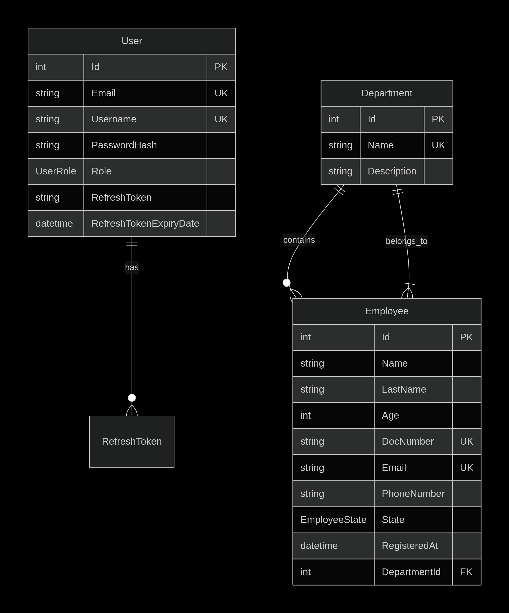
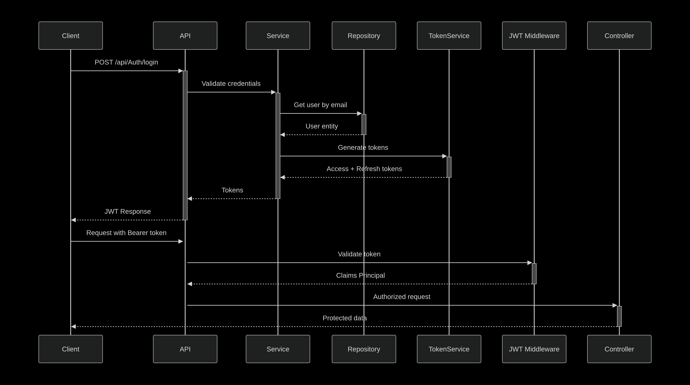
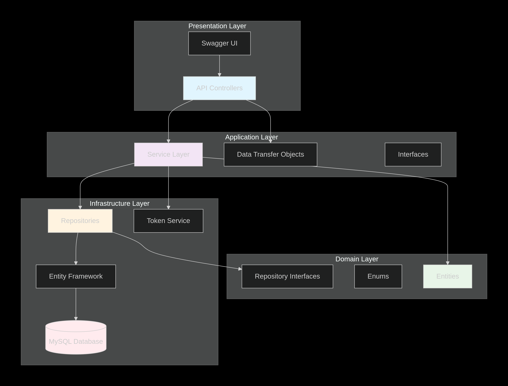

# Assessment_M6 - Employee & Department Management API

## 📖 Description

A robust RESTful API built with ASP.NET Core 9.0 for managing employees, departments, and users with JWT-based authentication and role-based authorization. This application follows Clean Architecture principles and provides complete CRUD operations with secure access control.

---

## 🏗️ Architecture

### Clean Architecture Layers

```
Assessment_M6/
├── Assessment_M6.Api/              
│   ├── Controllers/               
│   ├── Program.cs                 
│   └── appsettings.json           
├── Assessment_M6.Application/     
│   ├── DTOs/                     
│   ├── Interfaces/               
│   └── Services/                 
├── Assessment_M6.Domain/         
│   ├── Entities/                 
│   ├── Enums/                    
│   └── Interfaces/               
└── Assessment_M6.Infrastructure/  
    ├── Data/                     
    ├── Repositories/             
    └── Extensions/               
```
### Database Schema


### Authentication Flow


### Component Architecture


---

## 🚀 Getting Started

### Prerequisites

* .NET 9.0 SDK
* MySQL 8.0+
* Postman or similar API client
* Docker & Docker Compose (optional)

### Installation

#### **Option 1: Local Development**

Clone the repository:

```bash
git clone <repository-url>
cd Assessment_M6
```
Open appsetings.txt in this file you find enviroment variables:

[text](appsettings.txt)

Dont need config your local db is in Aiven


Run the application:

```bash
dotnet run
```

API available at: `https://localhost:5167`

#### **Option 2: Docker Deployment**

Build and run with Docker Compose:

```bash
docker-compose up --build
```


---

## 📚 API Documentation

### Authentication Endpoints

| Method | Endpoint           | Description        | Access        |
| ------ | ------------------ | ------------------ | ------------- |
| POST   | /api/Auth/login    | User login         | Public        |
| POST   | /api/Auth/register | User registration  | Public        |
| POST   | /api/Auth/refresh  | Refresh JWT tokens | Authenticated |

### User Management (Admin Only)

| Method | Endpoint                 | Description       |
| ------ | ------------------------ | ----------------- |
| GET    | /api/Users               | Get all users     |
| GET    | /api/Users/{id}          | Get user by ID    |
| GET    | /api/Users/email/{email} | Get user by email |
| POST   | /api/Users               | Create new user   |
| PUT    | /api/Users/{id}          | Update user       |
| DELETE | /api/Users/{id}          | Delete user       |

### Department Management (Admin Only)

| Method | Endpoint                     | Description            |
| ------ | ---------------------------- | ---------------------- |
| GET    | /api/Departments             | Get all departments    |
| GET    | /api/Departments/{id}        | Get department by ID   |
| GET    | /api/Departments/name/{name} | Get department by name |
| POST   | /api/Departments             | Create department      |
| PUT    | /api/Departments/{id}        | Update department      |
| DELETE | /api/Departments/{id}        | Delete department      |

### Employee Management

| Method | Endpoint                     | Description           | Access      |
| ------ | ---------------------------- | --------------------- | ----------- |
| GET    | /api/Employees               | Get all employees     | Admin       |
| GET    | /api/Employees/{id}          | Get employee by ID    | Admin       |
| GET    | /api/Employees/email/{email} | Get employee by email | Admin       |
| GET    | /api/Employees/me            | Get own profile       | User        |
| POST   | /api/Employees               | Create employee       | Admin       |
| PUT    | /api/Employees/{id}          | Update employee       | Admin/User* |
| DELETE | /api/Employees/{id}          | Delete employee       | Admin       |

*Users can only update their own profile.

---

## 🔐 Authentication & Authorization

### Default Admin User

```
Email: test@qwe.com
Username: test
Password: 123
Role: Admin
```

### JWT Token Flow

* Login returns accessToken (15 min) + refreshToken (7 days)
* Include access token as: `Authorization: Bearer {token}`
* Use refresh endpoint when expired

### Roles

* **Admin**: Full access
* **User**: Can only manage own employee profile

---

## 📊 Data Models

### User

```csharp
public class User
{
    public int Id { get; set; }
    public string Email { get; set; }
    public string Username { get; set; }
    public string PasswordHash { get; set; }
    public UserRole Role { get; set; }
    public string? RefreshToken { get; set; }
    public DateTime? RefreshTokenExpiryDate { get; set; }
}
```

### Employee

```csharp
public class Employee
{
    public int Id { get; set; }
    public string Name { get; set; }
    public string LastName { get; set; }
    public int Age { get; set; }
    public string DocNumber { get; set; }
    public string Email { get; set; }
    public string PhoneNumber { get; set; }
    public EmployeeState State { get; set; }
    public DateTime RegisteredAt { get; set; }
    public int DepartmentId { get; set; }
    public Department? Department { get; set; }
}
```

### Department

```csharp
public class Department
{
    public int Id { get; set; }
    public string Name { get; set; }
    public string Description { get; set; }
    public LinkedList<Employee> Employees { get; set; } = new();
}
```

---

## 🧪 Testing the API

### Using Postman

Environment variables example:

```
base_url: http://localhost:5167
admin_token: {{login_admin_response}}
user_token: {{login_user_response}}
```

Sample Requests
**Login:**

```bash
curl -X POST "http://localhost:5167/api/Auth/login" \
  -H "Content-Type: application/json" \
  -d '{"email":"test@qwe.com","password":"123"}'
```

**Create Department:**

```bash
curl -X POST "http://localhost:5167/api/Departments" \
  -H "Authorization: Bearer {token}" \
  -H "Content-Type: application/json" \
  -d '{"name":"HR","description":"Human Resources"}'
```

**Create Employee:**

```bash
curl -X POST "http://localhost:5167/api/Employees" \
  -H "Authorization: Bearer {token}" \
  -H "Content-Type: application/json" \
  -d '{"name":"John","lastName":"Doe","age":30,"docNumber":"12345678","email":"john@company.com","phoneNumber":"+1234567890","state":0,"departmentId":1}'
```

---

## 🐛 Troubleshooting

### Common Issues

**Database connection failed:**

* Ensure MySQL is running
* Check appsettings.json
* Validate credentials

**JWT token issues:**

* Access tokens last 15 minutes
* Use refresh token when expired

**403 Forbidden:**

* User lacks role permissions
* User trying to access another user's data

**409 Conflict:**

* Duplicate email, username, or DocNumber

---

## 📈 Performance Considerations

* EF Core connection pooling
* JWT validated in middleware
* Eager loading for employee->department
* Indexed fields

---

## 🔒 Security Features

* Password hashing (SHA256 + salt)
* Signed JWT tokens
* SQL injection protection
* CORS configurable
* Input validation
* Refresh token rotation

---

## 📁 Project Structure Details

### Key Files

* Program.cs
* appsettings.json
* TokenService.cs
* AppDbContext.cs
* Repository & Services

### Design Patterns

* Repository Pattern
* Service Layer
* DTO Pattern
* Dependency Injection
* Clean Architecture

---

## 🤝 Contributing

```text
Fork → Feature branch → Commit → Push → PR
```

---

## 📄 License

MIT License

---

## 👤 Author

**Name:** Miguel Angel Angarita
**Project:** Assessment_M6 - Employee Management System
**Date:** December 2025

---

> "Good code is like good espresso: concentrated, powerful, and best served hot." — J.A.R.V.I.S.
